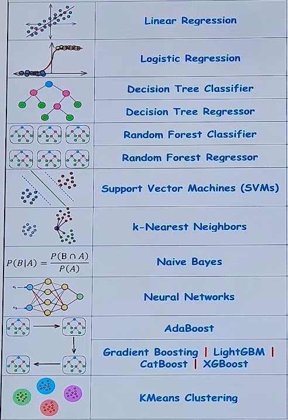

# Machine Learning With Python

Machine learning is a subset of artificial intelligence (AI) 

- [Foundation](./docs/foundation.md)
- [Tools and Libraries](./docs/tools_and_libraries.md)
- [Hello World - The basics](./docs/helloworld.md)
- [Load Persisted Model](./models/readme.md)

Turns out there are a few ML Algorithms and we need to choose the right one for our problem, Infinite Codes talks about using the right loss function for the algorithm, I liked the format and the visulisation of the algorithm on the left.

## Decision Tree Classifier
Super simple example, I think this is a good place to start learning ML

- [Text Recognition](./docs/codewithmosh.md)
- [Visualizing Decision Tree](./docs/visualizing-decision-tree.md)

**References**
- [Programming with Mosh: Python Machine Learning Tutorial (Data Science)](https://www.youtube.com/watch?v=7eh4d6sabA0)

## Neural Network
These are more complex and this example starts with a pre-trained ResNet Model

- [Image Recognition](./docs/image-recognition.md)

**References**
- [Karina Data Scientist: Build Image Recognition Model In Python in 20 min](https://www.youtube.com/watch?v=3qZsOyAy4Yc)