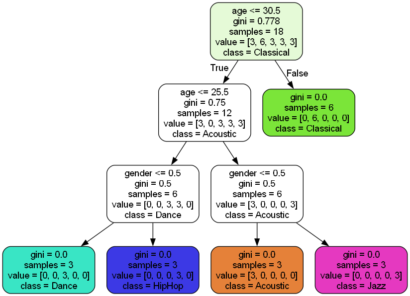

# Visualizing a Decision Tree

Create the file

```python
import pandas as pd
from sklearn.tree import DecisionTreeClassifier
from sklearn import tree

music_data = pd.read_csv('music.csv')
X = music_data.drop(columns=['genre'])
y = music_data['genre']

model = DecisionTreeClassifier()
model.fit(X, y)

# saves the output as `music.dot`
tree.export_graphviz(model, 
                     out_file='music.dot', 
                     feature_names=['age', 'gender'],
                     class_names=sorted(y.unique()),
                     label='all',
                     rounded=True,
                     filled=True)
```

View the file

The `.dot` format is a textual language for describing graphs, I tried the VS Extension [Graphviz (dot) language support for Visual Studio Code](https://marketplace.visualstudio.com/items?itemName=Stephanvs.dot) but it did not work for me.

Instead I installed [graphviz](https://graphviz.org/download/) for Windows and ran the following command

```
dot music.dot -Tpng -o image.png
```

Resulting in this file to visualize the binary tree, so every node can have a maximum of two children. The condition `age <= 30.5` is shown on the first node, based on this we go to the child node, `left->true` `right->false`

If `right->false` the user is older than 30, then the gender of music is Classical, this means the person was classified in this class.

If `left->true` then check then we check the age again, I would have thought here there would be a gender check but meh, it checks age, goes left/right again and then checks gender, all the while doing classification.

